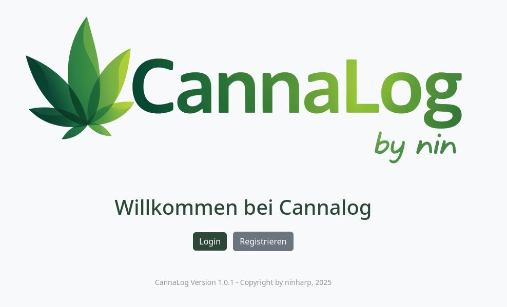
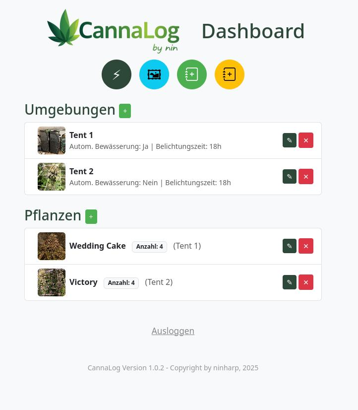
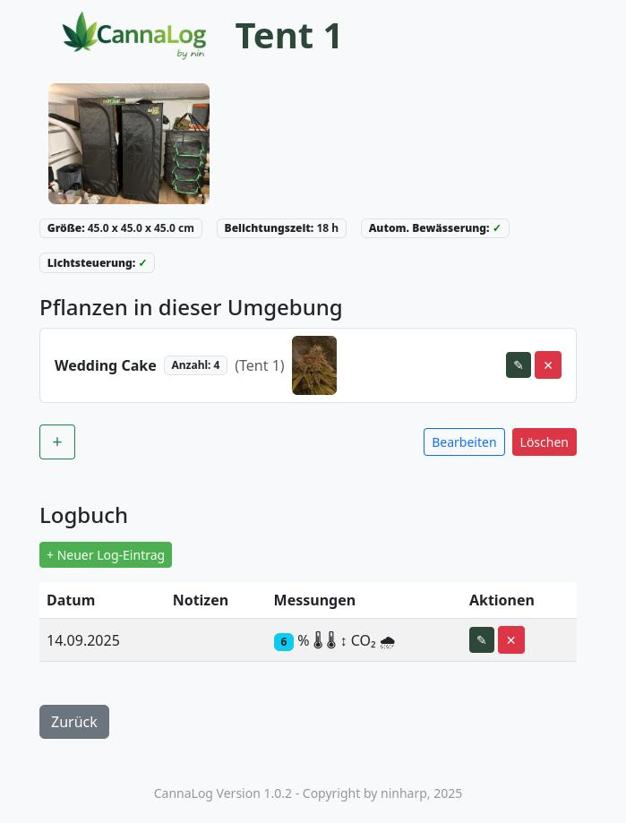
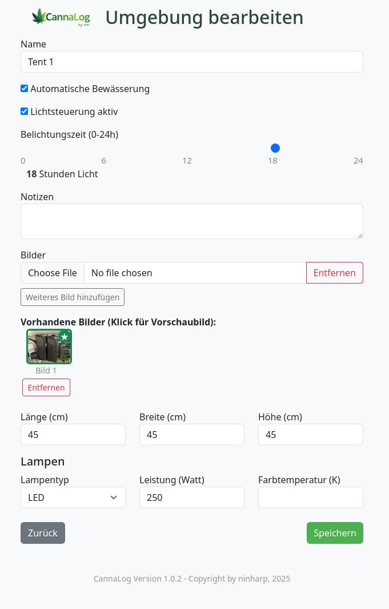
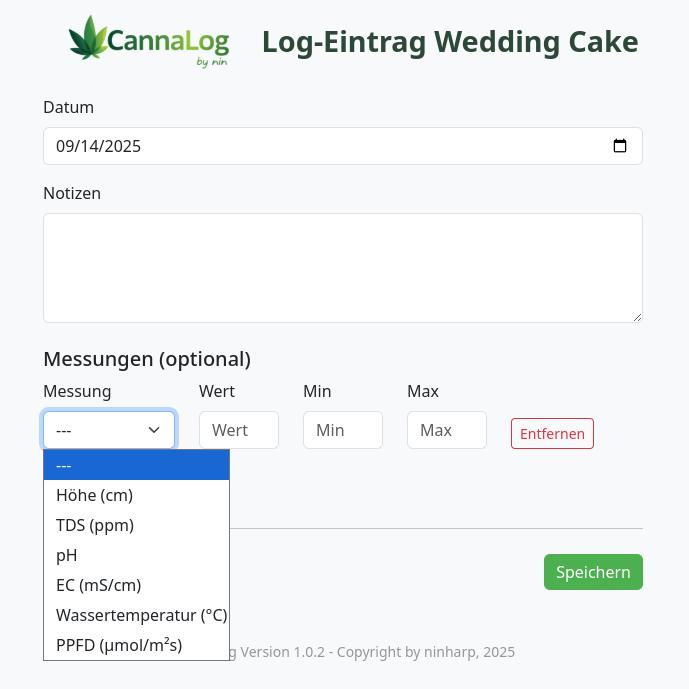
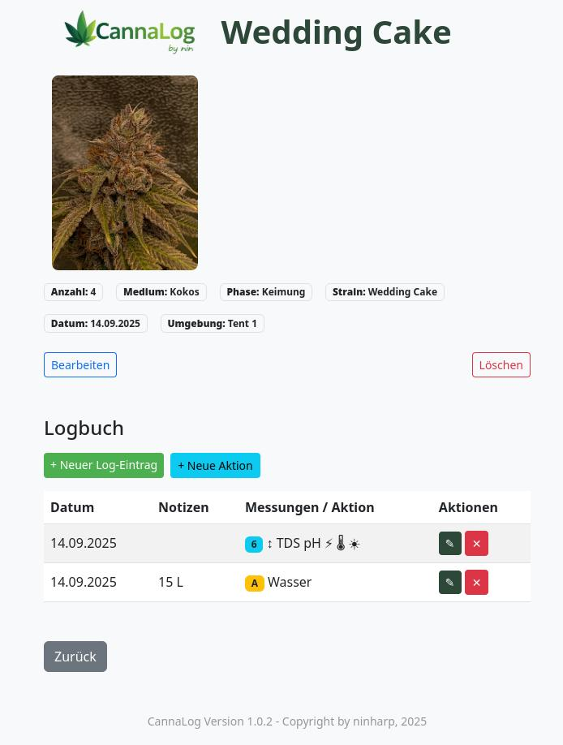
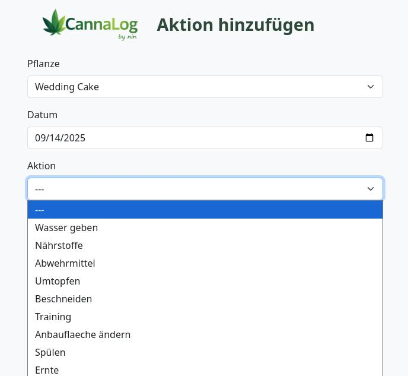
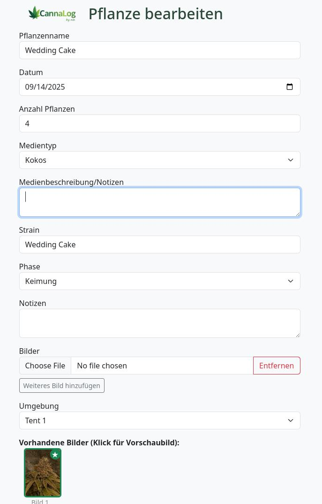

# Cannalog

CannaLog ist eine moderne, private Web-App zur Verwaltung von Pflanzen, Umgebungen, Messwerten, Aktionen und Bildern – optimiert für Desktop und Smartphone. Die Anwendung basiert auf Flask, SQLAlchemy und Bootstrap und bietet ein intuitives, responsives Dashboard für Grow- und Pflanzenprojekte.

## Features
- Pflanzen- und Umgebungsverwaltung mit Bildern und Notizen
- Logbuch für Messwerte (z.B. Temperatur, Feuchtigkeit, pH, EC, Licht, etc.)
- Aktionen-Log für Pflanzen (z.B. Gießen, Düngen, Umtopfen)
- Bild-Upload für Pflanzen und Umgebungen
- Auswahl von Vorschaubildern
- Responsive UI für Desktop und Mobile
- Zwei-Schritt-Bestätigung beim Löschen von Umgebungen mit Pflanzen
- Übersichtliche Dashboards und Detailansichten

## Screenshots

### Hauptansicht


### Login


### Dashboard


### Umgebungsübersicht


### Umgebungen editieren/hinzufügen


### Umgebungs-Logbuch


### Pflanzenübersicht


### Pflanzen-Logbuch


### Pflanzen-Aktion


### Pflanzen editieren/hinzufügen



## Installation & Ausführung

### Voraussetzungen
- Python 3.10+
- pip
- (optional) Virtuelle Umgebung

### Setup
1. Repository klonen:
   ```bash
   git clone <repo-url>
   cd cannalog
   ```
2. Virtuelle Umgebung erstellen (empfohlen):
   ```bash
   python3 -m venv .venv
   source .venv/bin/activate
   ```
3. Abhängigkeiten installieren:
   ```bash
   pip install -r requirements.txt
   ```
4. Datenbank initialisieren:
   ```bash
   flask db upgrade
   ```
5. App starten:
   ```bash
   flask run
   ```

Die App ist dann unter http://127.0.0.1:5000 erreichbar.

### Hinweise
- Standardmäßig werden Bilder im Ordner `/uploads` gespeichert.
- Die Konfiguration erfolgt über die Datei `config.py`.
- Für den Produktivbetrieb sollten Debug-Modus und Secret-Key angepasst werden.

## Lizenz
MIT License

---

Viel Spaß beim Dokumentieren und Verwalten deiner Pflanzen!
